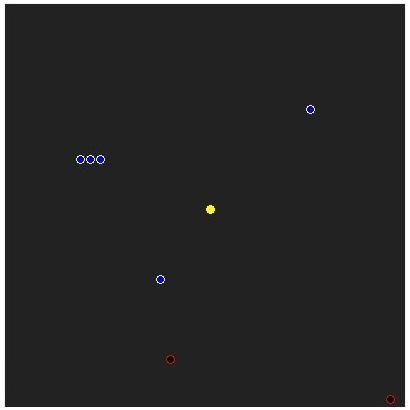

# HOW TO PLAY?
[JUMP TO DOWNLOAD INSTRUCTIONS](#step-1-download)
### REQUIREMEMNTS
These are the minimum requirements to run the game:  
- Python 3.8 or later
- 256MB RAM or better
- 2.7GHz CPU or faster
- 8MB free memory
- 450x700 pixel monitor or bigger
    
These are reccomended specifications to run the game:  
- Python 3.11
- 512MB RAM or more
- 2.7GHz CPU or faster
- 10MB free memory
- 1280x720, 1600x900 or 1920x1080 pixel monitor
### Step 1: Download
Basically download the entire repository.
### Step 2: Open `run.py`
Double click `run.py` to open it.
### Step 3: Play
Ignore the console window popping up and wait for the tkinter window to open.<br>
Enjoy playing! You can get more insights on how to play in-game by pressing `H` to open help, or by simply reading the key binds at the bottom of the screen.
<br><br>
# HOW TO CREATE CUSTOM LEVELS?
### Step 1: Open `gamedata` folder
This folder is located in the same directory as `run.py`. Inside, you can find `levels.py`, which stores nearly all the level data, except for non-random levels, whose data is located in `_leveldata.py`.
### Step 2: Open `levels.py` in edit mode
Ignore all the code besides the `DATA` list.
### Step 2: Add a new level to the `DATA` list
Simply add a comma and add a new entry. The entry needs to follow this syntax: `{"KEY": VALUE, "KEY2": VALUE2}`<br>
In the entry, replace all `KEY`s with data you want to change and `VALUE`s with the values you want to assign them.<br>
"pts" is the only required key. Here are all keys with exaplanation:
- "pts" = This is the amount of points required to win the level.
- "blue" = Specifies the amount of blue balls to spawn. Default = 0
- "black" = Specifies the amount of black balls to spawn. Default = 0
- "pos" = Specifies the spawn position of player. Default = (20,20)
- "data" = Custom level data. <b>[READ MORE HERE](#custom-level-data)</b>

Example: `{"blue": 10, "black": 3, "pts": 8, "pos": (10,17)}` creates a level with 10 blue balls and 3 black balls. You need to get 8 points to win this level.
You start at coordinates X:10;Y:17<br>
Note: The example is actually level 3 from the game.
### Step 3: Save and Play
Save `levels.py` and launch the game. In game, press `S` to skip the levels until you reach yours.
<br><br>
# WHAT IS THE PURPOSE OF THIS?
School.
<br><br>
# CUSTOM LEVEL DATA
Custom level data is a multiline string that uses a modified [SIMPLE QUERY](https://github.com/kingpvz/SimpleQuery) syntax to edit level data.<br>
When you include this key, level settings such as amount of blue balls, amount of black balls, etc. will be ignored.
## DOCUMENTATION
### Syntax
The syntax is very simple. Every command needs to be on a new line or separated by semicolons.<br>
Every command is made out of multiple statements and values separated by spaces. Since different commands can have different statements, each command in this documentation will be accompanied with its statement syntax.
### `at/put` | `put/at` Command
This is the only command at this time. You can use it to put a ball at a specified coordinate.<br>
Syntax: `at X Y put BALLTYPE` &nbsp;&nbsp;&nbsp; Example: `at 5 17 put blue`<br>
Alternative Syntax: `put BALLTYPE at X Y` &nbsp;&nbsp;&nbsp; Example: `put blue at 5 17`<br>
Syntax Explanation:
- `at` = label to begin this command
- `X` = X coordinate (0<=X<=39)
- `Y` = Y coordinate (0<=Y<=39)
- `put` = label to separate entries
- `BALLTYPE` = type of ball to put on set coordinates

<br>

Alternative Syntax Explanation:
- `put` = label to begin this command
- `BALLTYPE` = type of ball to put on set coordinates
- `at` = label to separate entries
- `X` = X coordinate (0<=X<=39)
- `Y` = Y coordinate (0<=Y<=39)
### Ball Types
- `blue` = Blue Ball, White Outline (+1 Point)
- `black` = Black Ball, Red Outline (-1 Point)
### Script Example
This script:
```
at 7 15 put blue; at 8 15 put blue;
at 9 15 put blue
at 16 35 put black; at 15 27 put blue; put black at 38 39
put blue at 30 10
```
Would produce this output:  

